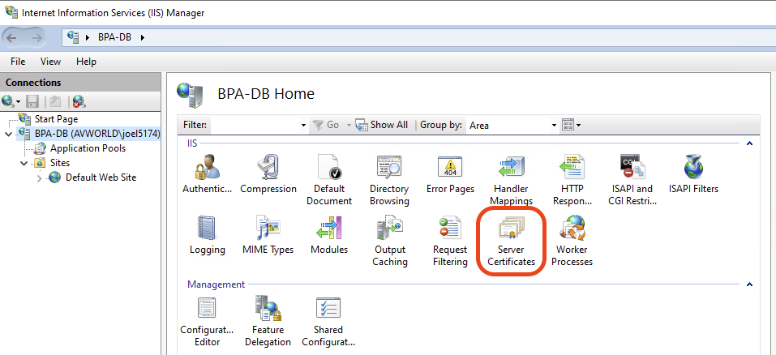
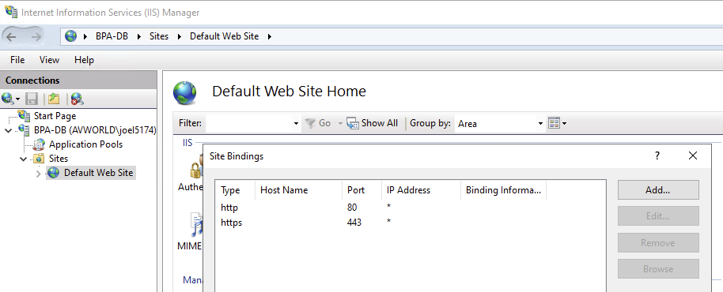

# Install IIS and Dependencies

## Install IIS

-   Control Panel > Programs > Turn Windows Features On or Off
-   Enable
    - Internet Information Services
        - Web Management Tools
            -   IIS Management Console
        - World Wide Web Services
        - Common HTTP Features
            - Default Document
            - Static Content
            - HTTP Errors
        - Application Development Features
            - ISAPI Extensions
            -   ISAPI Filters
-   Optional
    -   Security
        -   Basic Authentication (optional)
        -   Windows Authentication (if internal environment)
    -   Health and Diagnostics
        -   HTTP Logging
    -   Performance Features
        -   Static Content Compression

## Install Rewrite Dependencies

### Download and Install

-   [URL Rewrite](https://www.iis.net/downloads/microsoft/url-rewrite) (v2+)
-   [Application Request Routing](https://www.iis.net/downloads/microsoft/application-request-routing?ref=winstall) (ARR)

!!! note

    IIS must be restarted after to pick up these capabilities.
    
    ```
    iisreset
    ```

### Validate

-   At Server Level - Application Request Routing Cache
-   At Site Level - URL Rewrite

## Enable HTTPS Encryption on IIS

!!! note "Get Esri Domain Certificate"

    Domain certificates can be created and downloaded from the [Create SSL Server Certificates](https://certifactory.esri.com/certs/) 
    internal website if setting this up for internal Esri use.

Start by opening IIS Manager by searching for IIS Manager.

### Install Server Certificate in IIS

- In IIS Manager, select the machine name, and then open Server Certificates.
- Click on import, and import the *.pfx file in the dialog.



### Bind the Certificate to HTTPS

- In the IIS Connections tree, expand Sites and select Default Web Site.
- Right-click Default Web Site and choose Edit Bindings.
- Click Add.
- Change type to https.
- For SSL Certificate, choose the previously imported certificate.



	