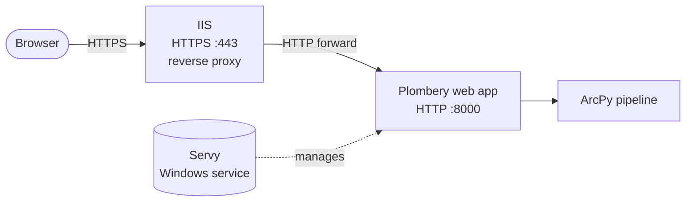

# Production Deployment Setup

End-to-end instructions for hosting the Plombery orchestrator on a Windows
server so it runs as a managed background service and is reachable from the
network over HTTPS. The deployment stack is:

1. **IIS** as a public-facing reverse proxy that handles HTTPS termination and
    forwards requests to the local Plombery web app.
2. **Servy** as the Windows-service wrapper that keeps
    [`scripts/plombery_orchestrator.py`](../../scripts/plombery_orchestrator.py)
    running across reboots and crashes.
3. The orchestrator script itself, which exposes the Plombery web UI on
    `http://localhost:8000`.



---

## 1. Install and Configure IIS

IIS handles HTTPS, the public hostname, and reverse-proxies traffic to
Plombery. Without it, Plombery would be exposed directly on port 8000 with no
TLS.

### 1.1 Enable Windows Features

Open **Control Panel → Programs → Turn Windows Features On or Off** and enable:

- **Internet Information Services**
    - **Web Management Tools**
        - IIS Management Console
    - **World Wide Web Services**
        - **Common HTTP Features** — Default Document, Static Content, HTTP Errors
        - **Application Development Features** — ISAPI Extensions, ISAPI Filters

Optional but recommended:

- **Security** — Basic Authentication, or Windows Authentication for internal use
- **Health and Diagnostics** — HTTP Logging
- **Performance Features** — Static Content Compression

### 1.2 Install the Reverse-Proxy Modules

The reverse proxy requires two extra IIS modules:

- [URL Rewrite](https://www.iis.net/downloads/microsoft/url-rewrite) (v2+) — rewrites the inbound URL into the local Plombery URL.
- [Application Request Routing](https://www.iis.net/downloads/microsoft/application-request-routing) (ARR) — performs the actual HTTP forwarding.

After both are installed, restart IIS so it picks them up:

```powershell
iisreset
```

Validate the install:

- **Server level** in IIS Manager — *Application Request Routing Cache* is listed.
- **Site level** in IIS Manager — *URL Rewrite* is listed.

### 1.3 Enable HTTPS

!!! note "Esri internal users"
    Domain certificates can be created and downloaded from the internal
    [Create SSL Server Certificates](https://certifactory.esri.com/certs/)
    site.

In IIS Manager:

1. Select the machine name, open **Server Certificates**, click **Import**, and
    select your `.pfx` file.

    

2. Under **Sites**, right-click **Default Web Site → Edit Bindings → Add**,
    choose type `https`, and select the certificate you just imported.

    

### 1.4 Configure the Reverse Proxy to Plombery

Plombery listens on `http://localhost:8000` (set in the orchestrator script).
IIS needs one URL Rewrite rule to forward all inbound requests to it.

1. In IIS Manager, enable proxying once at the server level:

    - Select the machine name → **Application Request Routing Cache**
        → **Server Proxy Settings** → tick **Enable proxy** → **Apply**.

2. At **Default Web Site → URL Rewrite → Add Rule(s) → Blank Rule**, set:

    | Field | Value |
    |---|---|
    | Name | `Plombery Reverse Proxy` |
    | Match URL → Using | `Regular Expressions` |
    | Match URL → Pattern | `(.*)` |
    | Action type | `Rewrite` |
    | Rewrite URL | `http://localhost:8000/{R:1}` |
    | Append query string | checked |

    !!! warning "`The rule reference "1" is not valid`"
        This alert means IIS doesn't see a capture group in the **Match URL**
        pattern. Make sure **Using** is set to `Regular Expressions` (not
        `Wildcards`) and that the **Pattern** is `(.*)` — the parentheses are
        the capture group that `{R:1}` refers to.

3. Apply, then browse to `https://<your-host>/` — at this point you'll get a
    `502` because Plombery is not yet running; that's expected.

!!! note "Hosting Plombery under a sub-path (e.g. `https://<your-host>/plombery`)"
    If the server also hosts other applications, you may want Plombery
    reachable at a sub-path rather than the site root. This requires two
    coordinated changes — one in IIS and one in the orchestrator script —
    because Plombery (FastAPI/Starlette under Uvicorn) generates redirect URLs
    and an OpenAPI schema based on a known *root path*.

    **In IIS:** replace the single rewrite rule above with one scoped to the
    sub-path. The pattern strips the prefix before forwarding so the upstream
    Plombery process still sees root-relative URLs:

    | Field | Value |
    |---|---|
    | Name | `Plombery Reverse Proxy` |
    | Match URL → Pattern | `^plombery(?:/(.*))?$` |
    | Action type | `Rewrite` |
    | Rewrite URL | `http://localhost:8000/{R:1}` |
    | Append query string | checked |

    **In the orchestrator script:** pass `root_path="/plombery"` to
    `uvicorn.run(...)` in
    [`scripts/plombery_orchestrator.py`](../../scripts/plombery_orchestrator.py)
    so FastAPI knows it is mounted at the prefix:

    ```python
    uvicorn.run(
        "plombery:get_app",
        host="0.0.0.0",
        port=8000,
        reload=False,
        factory=True,
        root_path="/plombery",
    )
    ```

    The value passed to `root_path` must match exactly the prefix stripped by
    the IIS rewrite rule. Restart the `ArcPy Orchestration` service via Servy
    Manager after changing this argument.

    !!! warning "Static assets may still resolve at the root"
        Plombery's frontend is a pre-built React bundle whose asset URLs are
        baked in at build time. If the UI loads but its JavaScript and CSS
        requests 404, add a second IIS rewrite rule that forwards any
        `/static/...` or `/assets/...` requests to `http://localhost:8000/`
        unchanged, *in addition* to the prefixed rule above.

---

## 2. Install Servy

Servy wraps any executable (here, `python.exe` running the orchestrator) as a
native Windows service. Compared to writing a custom service or using Task
Scheduler, Servy gives you automatic restart on failure, log rotation, and a
clean UI for editing the configuration.

1. Download the **.NET 10+ self-contained installer** from
    [servy-win.github.io](https://servy-win.github.io/). The self-contained
    build does not require a separate .NET runtime install.
2. Run the installer and accept the defaults; it installs both **Servy
    Desktop** (configures services) and **Servy Manager** (monitors them).

---

## 3. Configure the Plombery Service in Servy

This is the step that ties everything together: Servy launches
`python.exe scripts\plombery_orchestrator.py` under a managed account, restarts
it on failure, and writes its `stdout`/`stderr` to rotating log files.

!!! note "Prerequisites"
    - The conda environment defined by [`environment.yml`](../../environment.yml)
        is installed (typically the ArcGIS Pro conda environment, since ArcPy is
        required).
    - You know the absolute paths to:
        - The Python interpreter inside that environment (e.g.
            `C:\Program Files\ArcGIS\Pro\bin\Python\envs\arcpy_orchestration\python.exe`).
        - The project root (e.g. `C:\projects\arcpy-orchestration`).

Launch **Servy Desktop** as Administrator (`Servy.exe`), click **New**, and
fill in each tab as follows.

### 3.1 Service Details (Main)

This is the only tab strictly required.

| Field | Value |
|---|---|
| Service Name | `ArcPy Orchestration` |
| Description | `Plombery orchestrator for the ArcPy park-access pipeline.` |
| Executable Path | full path to `python.exe` from your conda env |
| Arguments | `scripts\plombery_orchestrator.py` |
| Startup Directory | full path to the project root |
| Startup Type | `Automatic` |
| Enable Console UI | **off** (the orchestrator does not paint the console) |

!!! tip
    Using a relative path in **Arguments** plus the project root as
    **Startup Directory** keeps the service config portable and makes Python's
    `Path(__file__).parent.parent` resolution behave the same as when you run
    the script manually.

### 3.2 Logging

`stdout` and `stderr` from `python.exe` are captured by Servy and written to
disk. The Plombery web UI shows per-run logs, but this captures everything
*outside* a pipeline run (FastAPI startup messages, unhandled exceptions, etc.).

| Field | Value |
|---|---|
| Enable stdout logging | on |
| stdout log path | `<project root>\reports\logs\plombery_stdout.log` |
| Enable stderr logging | on |
| stderr log path | `<project root>\reports\logs\plombery_stderr.log` |
| Rotation | size-based, e.g. `10 MB` |
| Max files to retain | `10` |
| Enable debug logs | off (only enable temporarily — Servy warns it can record sensitive info to its own log) |

### 3.3 Recovery

These actions tell Servy what to do when `python.exe` exits unexpectedly. A
crashing pipeline run does **not** crash the orchestrator (Plombery catches
task exceptions), so any process exit here means something is genuinely wrong.

| Field | Value |
|---|---|
| First failure | `Restart the service` |
| Second failure | `Restart the service` |
| Subsequent failures | `Take no action` (prevents tight restart loops) |
| Reset failure count after | `1 day` |
| Restart delay | `30 seconds` |

### 3.4 Log On

The service account needs read/write access to the project's `data/` and
`reports/logs/` directories and read access to the conda environment.

- **`LocalSystem`** is simplest and works for most internal setups.
- For least-privilege deployments, create a dedicated domain account, grant it
    write access to `%ProgramData%\Servy` (Servy requires this for any
    non-system account), the project root, and the conda environment.

### 3.5 Advanced — Environment Variables

The orchestrator reads `PROJECT_ENV` to choose the right
`environments.<name>` block in [`config/config.yml`](../../config/config.yml).

Add one variable:

| Name | Value |
|---|---|
| `PROJECT_ENV` | `prod` |

Leave **Service Dependencies** empty unless the orchestrator must wait for
another local service (e.g. a database) to start first.

### 3.6 Pre-Launch / Post-Launch / Pre-Stop / Post-Stop

Not needed for this deployment. Leave all four tabs empty.

### 3.7 Install and Start

1. Click **Install** — Servy registers the service with the Windows Service
    Control Manager.
2. Open **Servy Manager**, find `ArcPy Orchestration`, and click **Start**.
3. Watch the *Real-time* log pane for a line similar to:

    ```text
    INFO:     Uvicorn running on http://0.0.0.0:8000 (Press CTRL+C to quit)
    ```

    That confirms Plombery is up.

4. Browse to `https://<your-host>/`. The Plombery UI should load through the
    IIS reverse proxy, list the `park_access_pipeline`, and let you trigger it
    manually.

---

## 4. Smoke Test the Pipeline

1. In the Plombery UI, open `park_access_pipeline`.
2. Click **Run now**.
3. The four tasks (`project_inputs`, `find_parcels_near_parks`, `summarize`,
    `export`) should appear in the run list. Click any task to see its
    `arcpy_orchestration` log messages — these reach the UI via the
    `PlomberyHandler` described in
    [Plombery Logging Integration](plombery_logging_integration.md).
4. Confirm the output Excel workbook is written to the path defined under
    `park_access.output_summary_path` in [`config/config.yml`](../../config/config.yml).

---

## Troubleshooting

| Symptom | Likely cause |
|---|---|
| Service starts then immediately exits | Wrong `python.exe` path, missing `arcpy_orchestration` install, or syntax error in the orchestrator script. Check `reports/logs/plombery_stderr.log`. |
| `502 Bad Gateway` from IIS | The orchestrator process is not running, or it bound to a different port than `8000`. Check Servy Manager and `plombery_stdout.log`. |
| Pipeline logs do not appear in the UI | Confirm `import arcpy_orchestration` runs at the top of the orchestrator (this is what installs the `PlomberyHandler`). |
| Excel output not written | The `assessed_value` field name in `config.park_access.value_field` does not match the real Thurston parcels schema. Inspect the parcels feature class and update the config. |
| `openpyxl` ImportError | Recreate the conda environment after the `openpyxl` dependency was added to [`environment.yml`](../../environment.yml). |
