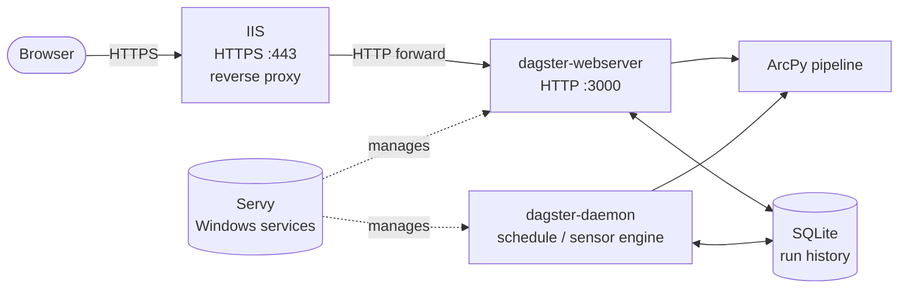

# Dagster — Production Deployment Setup

This guide walks through standing up the project's ArcPy pipeline as a
production Dagster deployment on a Windows server. The end result is a
scheduled, monitored, self-restarting orchestrator accessible to users over
HTTPS on the corporate network. The deployment stack is:

1. **IIS** as a public-facing reverse proxy that handles HTTPS termination and
    forwards requests to the local Dagster web UI.
2. **Servy** as the Windows-service wrapper that keeps both Dagster processes
    running across reboots and crashes.
3. **`dagster-webserver`** — the Dagster UI, exposed on `http://localhost:3000`.
4. **`dagster-daemon`** — the background process that fires scheduled runs,
    evaluates sensors, and manages run queuing.

!!! note "Two processes required"
    Dagster splits its concerns across two long-running processes: the webserver
    serves the UI and accepts manual launch requests, while the daemon is
    responsible for evaluating schedules and sensors and queuing runs. Both must
    be running for scheduled jobs to execute automatically.



IIS is the public front door for the deployment: it terminates HTTPS at the
server's hostname and forwards traffic to the Dagster web UI running locally
on port 3000. Configuring it first means the reverse-proxy rule is in place
and ready to route requests as soon as the Dagster services come online.

### 1.1 Enable Windows Features

Open **Control Panel → Programs → Turn Windows Features On or Off** and enable:

- **Internet Information Services**
    - **Web Management Tools** — IIS Management Console
    - **World Wide Web Services**
        - **Common HTTP Features** — Default Document, Static Content, HTTP Errors
        - **Application Development Features** — ISAPI Extensions, ISAPI Filters

### 1.2 Install the Reverse-Proxy Modules

- [URL Rewrite](https://www.iis.net/downloads/microsoft/url-rewrite) (v2+)
- [Application Request Routing](https://www.iis.net/downloads/microsoft/application-request-routing) (ARR)

After both are installed, restart IIS so it picks up the new modules. In
**IIS Manager**, select the server (machine name) at the top of the
**Connections** pane on the left, then click **Restart** under the **Manage
Server** group in the **Actions** pane on the right.

### 1.3 Enable HTTPS

!!! warning "Security Certificate"
    You will need a security certificate for your machine to successfully
    complete this step.

In IIS Manager:

1. Select the machine name → **Server Certificates → Import** → select your `.pfx` file.
2. **Sites → Default Web Site → Edit Bindings → Add**, choose type `https`, and
    select the certificate you just imported.

!!! note "Esri Internal Users"
    Domain certificates can be created and downloaded from the internal
    [Create SSL Server Certificates](https://certifactory.esri.com/certs/) site.

### 1.4 Configure the Reverse Proxy to Dagster

Dagster's web UI listens on `http://localhost:3000` by default.

1. Enable proxying at the server level: select the machine name →
    **Application Request Routing Cache → Server Proxy Settings → Enable proxy → Apply**.

2. At **Default Web Site → URL Rewrite → Add Rule(s) → Blank Rule**, set:

    | Field | Value |
    |---|---|
    | Name | `Dagster Reverse Proxy` |
    | Match URL → Using | `Regular Expressions` |
    | Match URL → Pattern | `(.*)` |
    | Action type | `Rewrite` |
    | Rewrite URL | `http://localhost:3000/{R:1}` |
    | Append query string | checked |

    !!! warning "`The rule reference "1" is not valid`"
        This alert means IIS doesn't see a capture group in the **Match URL**
        pattern. Make sure **Using** is set to `Regular Expressions` (not
        `Wildcards`) and that the **Pattern** is `(.*)` — the parentheses are
        the capture group that `{R:1}` refers to.

3. Apply, then browse to `https://<your-host>/` — you will get a `502` until
    the Dagster service is running; that is expected.

!!! note "Hosting Dagster under a sub-path (e.g. `https://<your-host>/dagster`)"
    If the server also hosts other applications, you may want Dagster reachable
    at a sub-path rather than the site root. This requires two coordinated
    changes — one in IIS and one in the Dagster webserver arguments — because
    Dagster generates absolute URLs for its static assets based on a known
    *path prefix*.

    **In IIS:** replace the single rewrite rule above with one scoped to the
    sub-path. The pattern strips the prefix before forwarding so the upstream
    Dagster process still sees root-relative URLs:

    | Field | Value |
    |---|---|
    | Name | `Dagster Reverse Proxy` |
    | Match URL → Pattern | `^dagster(?:/(.*))?$` |
    | Action type | `Rewrite` |
    | Rewrite URL | `http://localhost:3000/{R:1}` |
    | Append query string | checked |

    **In Dagster:** start `dagster-webserver` with the matching `--path-prefix`
    flag (see §6.1) so it generates asset URLs under `/dagster`:

    ```text
    -w "...\workspace.yaml" -h 0.0.0.0 -p 3000 --path-prefix /dagster
    ```

    Without `--path-prefix`, the UI will load but its JavaScript and CSS
    requests will 404 because they will be issued against the site root rather
    than the sub-path.

---

## 2. Install Dagster

Dagster must be installed alongside `arcpy`, but installing it directly into
the stock ArcGIS Pro `arcgispro-py3` environment is not supported — that
environment is managed by ArcGIS Pro and pip-installing into it can break
future Pro upgrades. Instead, **clone** `arcgispro-py3` into the project tree
and install Dagster into the clone.

!!! tip "Automated alternative"
    The script [`scripts/setup_dagster.ps1`](../../scripts/setup_dagster.ps1)
    performs §2.1 and §2.2 (and the rest of this guide) end-to-end from an
    elevated PowerShell session. The manual steps below are equivalent and
    are documented for transparency and partial reruns.

### 2.1 Clone the `arcgispro-py3` environment

ArcGIS Pro ships its own conda distribution. The simplest way to get a shell
where `conda` is on `PATH` and pointed at the Pro-bundled installation is to
open the **Python Command Prompt** that ArcGIS Pro installs:

**Start → All Programs → ArcGIS → Python Command Prompt**

In that prompt, change directory to the project root and run a single command
to clone the stock environment into an `env\` directory inside the project:

```
cd C:\projects\arcpy-orchestration
conda create --prefix ./env --clone arcgispro-py3
```

Answer `y` when conda prompts to proceed. Using the conda binary that ships
with ArcGIS Pro — rather than a separately installed Anaconda or Miniconda —
ensures the clone resolves the same channels and metadata Pro itself uses.

!!! warning "Allow time and disk space"
    A full clone of `arcgispro-py3` typically takes 5–15 minutes and consumes
    several GB of disk space. The clone is a complete copy, not a hard-linked
    overlay.

### 2.2 Install Dagster into the clone

Still in the Python Command Prompt at the project root, activate the cloned
env and install Dagster with `pip`:

```
conda activate ./env
pip install dagster dagster-webserver
```

Verify the install:

```
dagster --version
dagster-webserver --version
dagster-daemon --version
```
---

## 3. Configure the Dagster Instance

Dagster reads all instance-level configuration from a directory pointed to by
the `DAGSTER_HOME` environment variable. Create that directory and populate it
with two files.

### 3.1 Choose `DAGSTER_HOME`

A sensible location that keeps instance data inside the project tree:

```
C:\projects\arcpy-orchestration\dagster_home\
```

Create the directory:

```powershell
New-Item -ItemType Directory -Force "C:\projects\arcpy-orchestration\dagster_home"
```

### 3.2 `dagster.yaml` — Instance Configuration

`dagster.yaml` lives at the root of `DAGSTER_HOME` and configures the run
storage, event log storage, and compute log storage backends. The default
(SQLite) is fine for single-server deployments.

```yaml
# C:\projects\arcpy-orchestration\dagster_home\dagster.yaml

storage:
  sqlite:
    base_dir: "C:\\projects\\arcpy-orchestration\\dagster_home\\storage"

compute_logs:
  local_directory:
    base_dir: "C:\\projects\\arcpy-orchestration\\dagster_home\\compute_logs"
```

!!! warning "SQLite is not recommended for production"

    These instructions configure Dagster's run storage, event log, and compute
    log backends using **SQLite** (the default). SQLite is fine for a single
    developer evaluating the stack, but Dagster explicitly
    [recommends PostgreSQL for production deployments](https://docs.dagster.io/guides/deploy/dagster-instance#postgresql--mysql-recommended-for-production)
    for several reasons:

    - SQLite uses file-level locking, so concurrent writes from
      `dagster-webserver` and `dagster-daemon` can produce lock contention
      under load.
    - Large run histories degrade SQLite read performance over time.
    - SQLite files are not safe to place on a network share or cloud-mounted
      drive, which limits backup strategies.
    - PostgreSQL supports Dagster's
      [run concurrency limits](https://docs.dagster.io/guides/operate/managing-concurrency)
      and [auto-materialisation](https://docs.dagster.io/guides/build/assets/auto-materialize)
      features more reliably.

    To switch to PostgreSQL, replace the `storage:` block in
    `dagster_home/dagster.yaml` (§3.2) with:

    ```yaml
    storage:
      postgres:
        postgres_db:
          username: dagster
          password:
            env: DAGSTER_PG_PASSWORD
          hostname: localhost
          db_name: dagster
          port: 5432
    ```

    Store the password in an environment variable (`DAGSTER_PG_PASSWORD`) added
    to both Servy service configs (§6.1 and §6.2 **Advanced → Environment
    Variables**) rather than in the YAML file. See the
    [Dagster instance configuration reference](https://docs.dagster.io/guides/deploy/dagster-instance)
    for the full set of options and the
    [`dagster-postgres` package](https://docs.dagster.io/api/python-api/libraries/dagster-postgres)
    for the required additional dependency (`pip install dagster-postgres`).

### 3.3 `workspace.yaml` — Code Location

`workspace.yaml` tells both `dagster-webserver` and `dagster-daemon` where to
find the job definitions. Use `relative_path` so the configuration stays
portable across machines and checkout locations — Dagster resolves it relative
to the directory containing `workspace.yaml` itself, not to the current working
directory or `DAGSTER_HOME`.

```yaml
# C:\projects\arcpy-orchestration\dagster_home\workspace.yaml

load_from:
  - python_file:
      relative_path: "../scripts/dagster_definitions.py"
      attribute: defs
```

`attribute: defs` names the `Definitions` object that the file exposes (see
§4 below).

!!! tip "When to prefer `absolute_path`"
    Use `absolute_path` if `DAGSTER_HOME` lives outside the project tree (for
    example, on a shared drive or under `%ProgramData%`). `relative_path` only
    works when the relative layout between `workspace.yaml` and the
    definitions file is stable across deployments.

---

## 4. Understand the Dagster Definitions

The pipeline's Dagster wiring lives in
[`scripts/dagster_definitions.py`](../../scripts/dagster_definitions.py).
This single file is the entry point referenced by
`dagster_home/workspace.yaml` (see §3.3) and is loaded by both
`dagster-webserver` and `dagster-daemon` at startup. For a typical deployment
of *this* project no edits are required — the rest of this section explains
the patterns the file uses so you can apply the same structure when adapting
the project, or porting these conventions to a pipeline of your own.

### 4.1 What the file is responsible for

A Dagster definitions module has four jobs:

1. **Make the project package importable** when Dagster loads the file from a
    working directory of its own choosing (it does not respect a
    `pip install -e .` happening in some other shell).
2. **Translate plain Python functions into Dagster ops** — the unit Dagster
    knows how to schedule, retry, log, and visualize.
3. **Wire those ops into a `@job`** that defines the dependency graph.
4. **Expose a top-level `Definitions` object** named exactly the value listed
    under `attribute:` in `workspace.yaml` (here, `defs`).

### 4.2 Key patterns and why they matter

The numbered points below map directly onto sections of
[`scripts/dagster_definitions.py`](../../scripts/dagster_definitions.py).

#### Bootstrap so `arcpy_orchestration` is importable

```python
DIR_PRJ = Path(__file__).parent.parent

if importlib.util.find_spec("arcpy_orchestration") is None:
    src_dir = DIR_PRJ / "src"
    if not src_dir.exists():
        raise EnvironmentError("Unable to import arcpy_orchestration.")
    sys.path.insert(0, str(src_dir))
```

In a properly provisioned conda env (§2.2) the editable install puts
`arcpy_orchestration` on `sys.path` and the `if` branch is a no-op. The
fallback exists so that a developer who clones the repo and runs `dagster
dev -f scripts/dagster_definitions.py` *before* running `pip install -e .` still
gets a working module rather than a confusing `ModuleNotFoundError` from
inside the daemon.

!!! tip "Apply this pattern to your own definitions"
    Always derive `DIR_PRJ` from `Path(__file__)`, not from the current
    working directory. Dagster sets its own CWD, and relative paths derived
    from `os.getcwd()` will silently break in production.

#### Import the package once, get logging for free

```python
import arcpy_orchestration  # noqa: F401, E402
```

This single line ensures every module-level logger configured by the package
is initialised before any op runs. Because Dagster captures records on the
**root** Python logger during op execution, and `arcpy_orchestration` module
loggers propagate by default, this is the *only* configuration required for
package log output to appear in the Dagster UI. See §4.3 below.

#### Resolve config values at module scope, not inside ops

```python
WORKING_WKID: int = config.spatial.working_wkid
WALK_DISTANCE_M: float = config.park_access.walk_distance_m
PARKS_FC: str = str(DIR_PRJ / config.park_access.parks_fc)
```

Reading [`config/config.yml`](../../config/config.yml) once at import time
keeps the ops focused on orchestration. It also surfaces config errors at
load time — `dagster-webserver` will refuse to start with a clear traceback
rather than silently failing on the first scheduled run. Never hardcode WKIDs,
distances, or paths inside an op body.

#### One op per logical step, with explicit `In`/`Out` types

```python
@op(out={"parks_fc": Out(str), "parcels_fc": Out(str)})
def project_inputs(context):
    ...
    yield Output(parks, output_name="parks_fc")
    yield Output(parcels, output_name="parcels_fc")
```

Each op wraps a single function from `arcpy_orchestration.park_access`. The
op layer adds nothing the underlying function doesn't already do — it only
declares the inputs and outputs so Dagster can render the dependency graph,
type-check connections at job-build time, and persist intermediate values.

!!! note "Ops should be thin"
    Resist the urge to put real work directly inside an `@op`. Keeping the
    business logic in a plain Python module (`arcpy_orchestration.park_access`
    here) means it stays unit-testable without spinning up a Dagster instance,
    and the same code can be reused from a notebook, a Python toolbox, or a
    different orchestrator.

#### Use `context.log` for op-level milestones

```python
context.log.info("Wrote selected parcels to %s", result)
```

`context.log` automatically tags the message with the run ID, step key, and
op name in the UI. Use it for the high-level "what just happened" milestones
that a future operator scanning the run timeline will want to see. Detailed
diagnostics (`logger.debug(...)` from inside `arcpy_orchestration`) flow
through the root-logger capture described below and end up in the same place
without any extra plumbing.

#### Assemble ops into a `@job`

```python
@job(description="...")
def park_access_job() -> None:
    parks_fc, parcels_fc = project_inputs()
    parcels = find_parcels_near_parks(parks_fc=parks_fc, parcels_fc=parcels_fc)
    summary = summarize(parcels_fc=parcels)
    export(summary_df=summary)
```

The `@job` body looks like ordinary Python but is actually compiled by
Dagster into a DAG. Pass op outputs to op inputs using **named keyword
arguments** that match the `In(...)` keys — this makes the wiring explicit
and survives reordering.

#### Schedule the job, don't schedule the ops

```python
park_access_daily = ScheduleDefinition(
    job=park_access_job,
    cron_schedule="0 0 * * *",
    name="park_access_daily",
    execution_timezone="America/Los_Angeles",
)
```

Always set `execution_timezone` explicitly. Without it Dagster uses UTC, which
is rarely what an analyst expects when they look at a daily-midnight cron.

#### Expose a single `Definitions` object

```python
defs = Definitions(
    jobs=[park_access_job],
    schedules=[park_access_daily],
)
```

This is the object `workspace.yaml`'s `attribute: defs` resolves to. Dagster
will only see entities (jobs, schedules, sensors, assets, resources) that are
listed here.

### 4.3 Logging integration

Dagster's op executor installs a handler on the Python root logger for the
duration of each op execution. Because `arcpy_orchestration` module loggers
propagate to the root by default, **no custom handler is required** — log
records from `arcpy_orchestration` appear automatically in the Dagster UI
run timeline and compute logs.

The `context.log` calls in the ops add op-level context (step key, run ID)
to messages you emit directly. Use `context.log` for op-level milestones and
trust the module loggers for detailed diagnostic output.

!!! note
    Dagster attaches its log capture to the standard Python root logger, which
    means any module that propagates records up the standard hierarchy (the
    default for all `arcpy_orchestration` module loggers) will have its output
    captured automatically — no custom handler or configuration is required.

---

## 5. Install Servy

Servy wraps any executable as a native Windows service. It provides automatic
restart on failure, log rotation, and a simple UI for editing the configuration.

1. Download the **.NET 10+ self-contained installer** from
    [servy-win.github.io](https://servy-win.github.io/).
2. Run the installer and accept the defaults.

---

## 6. Configure the Dagster Services in Servy

Dagster requires **two separate Servy services** — one for `dagster-webserver`
and one for `dagster-daemon`. Both share the same `DAGSTER_HOME`.

!!! note "Prerequisites"
    - The cloned conda environment at `C:\projects\arcpy-orchestration\env`
        exists (see §2.1) and contains `dagster`, `dagster-webserver`, and
        `dagster-daemon` (see §2.2).
    - You know the absolute path to the `dagster-webserver.exe` and
        `dagster-daemon.exe` scripts in the cloned env's `Scripts\`
        directory (e.g.
        `C:\projects\arcpy-orchestration\env\Scripts\dagster-webserver.exe`).
    - `C:\projects\arcpy-orchestration\dagster_home\dagster.yaml` and
        `workspace.yaml` exist (see §3).

Launch **Servy Desktop** as Administrator, click **New** for each service, and
fill in each tab as follows.

### 6.1 Service 1 — `dagster-webserver` (the UI)

#### Main

| Field | Value |
|---|---|
| Service Name | `DagsterWebserver` |
| Display Name | `Dagster Webserver` |
| Description | `Dagster web UI for the ArcPy orchestration project.` |
| Executable Path | full path to `dagster-webserver.exe` in the conda env `Scripts\` directory |
| Arguments | `-w "C:\projects\arcpy-orchestration\dagster_home\workspace.yaml" -h 0.0.0.0 -p 3000` |
| Startup Directory | `C:\projects\arcpy-orchestration` |
| Startup Type | `Automatic` |
| Enable Console UI | **off** |

!!! note "Hosting under a sub-path"
    If you configured IIS to expose Dagster at a sub-path such as
    `https://<your-host>/dagster` (see the note in §1.4), the **Arguments**
    field must include the matching `--path-prefix` flag so the webserver
    generates correct static-asset URLs:

    ```text
    -w "C:\projects\arcpy-orchestration\dagster_home\workspace.yaml" -h 0.0.0.0 -p 3000 --path-prefix /dagster
    ```

    The value passed here must match exactly the prefix stripped by the IIS
    rewrite rule. Restart the `DagsterWebserver` service via Servy Manager
    after changing this argument.

#### Logging

| Field | Value |
|---|---|
| Enable stdout logging | on |
| stdout log path | `C:\projects\arcpy-orchestration\reports\logs\dagster_webserver_stdout.log` |
| Enable stderr logging | on |
| stderr log path | `C:\projects\arcpy-orchestration\reports\logs\dagster_webserver_stderr.log` |
| Rotation | date-based, daily |
| Max files to retain | `14` |

#### Recovery

| Field | Value |
|---|---|
| First failure | `Restart the service` |
| Second failure | `Restart the service` |
| Subsequent failures | `Take no action` |
| Reset failure count after | `1 day` |
| Restart delay | `30 seconds` |

#### Log On

- **`LocalSystem`** for simplest setups.
- For least-privilege: create a dedicated account, grant it write access to
    `%ProgramData%\Servy`, the project root, and the conda environment.

#### Advanced — Environment Variables

Both Dagster processes read their instance configuration from `DAGSTER_HOME`.
Add two variables:

| Name | Value |
|---|---|
| `DAGSTER_HOME` | `C:\projects\arcpy-orchestration\dagster_home` |
| `PROJECT_ENV` | `prod` |

---

### 6.2 Service 2 — `dagster-daemon` (the scheduler)

The daemon evaluates schedules, sensors, and the run queue. Without it,
scheduled runs will never fire.

#### Main

| Field | Value |
|---|---|
| Service Name | `DagsterDaemon` |
| Display Name | `Dagster Daemon` |
| Description | `Dagster schedule and sensor daemon for the ArcPy orchestration project.` |
| Executable Path | full path to `dagster-daemon.exe` in the conda env `Scripts\` directory |
| Arguments | `run -w "C:\projects\arcpy-orchestration\dagster_home\workspace.yaml"` |
| Startup Directory | `C:\projects\arcpy-orchestration` |
| Startup Type | `Automatic` |
| Enable Console UI | **off** |

#### Logging

| Field | Value |
|---|---|
| Enable stdout logging | on |
| stdout log path | `C:\projects\arcpy-orchestration\reports\logs\dagster_daemon_stdout.log` |
| Enable stderr logging | on |
| stderr log path | `C:\projects\arcpy-orchestration\reports\logs\dagster_daemon_stderr.log` |
| Rotation | date-based, daily |
| Max files to retain | `14` |

#### Recovery

Same as the webserver service above.

#### Log On

Use the same account as the webserver service.

#### Advanced — Environment Variables

| Name | Value |
|---|---|
| `DAGSTER_HOME` | `C:\projects\arcpy-orchestration\dagster_home` |
| `PROJECT_ENV` | `prod` |

---

### 6.3 Service Dependencies

Open the **Dependencies** tab of `DagsterDaemon` and add `DagsterWebserver` as
a dependency. This ensures the webserver (and its shared SQLite storage) is
fully initialized before the daemon starts.

### 6.4 Install and Start

1. In **Servy Desktop**, install each service by clicking **Install**.
2. Open **Servy Manager**, start `DagsterWebserver` first.
3. Watch the stdout log for:

    ```text
    Serving dagster-webserver on http://0.0.0.0:3000 in process ...
    ```

4. Start `DagsterDaemon` and confirm in its stdout log that it connected to the
    instance storage and loaded the schedule.
5. Browse to `https://<your-host>/`. The Dagster UI should load, show the
    `park_access_job` under **Jobs**, and list `park_access_daily` under
    **Schedules**.

---

## 7. Enable the Schedule

Dagster schedules are created in a **paused** state and must be explicitly
turned on after deployment.

In the Dagster UI:

1. Navigate to **Schedules → `park_access_daily`**.
2. Toggle the schedule to **Running**.

Alternatively, from the command line (with `DAGSTER_HOME` set):

```powershell
$env:DAGSTER_HOME = "C:\projects\arcpy-orchestration\dagster_home"
dagster schedule start park_access_daily
```

---

## 8. Smoke Test the Pipeline

1. In the Dagster UI, open **Jobs → `park_access_job`**.
2. Click **Materialize all** (or **Launch run**) to trigger a manual run.
3. Open the run in the **Runs** view. The four ops (`project_inputs`,
    `find_parcels_near_parks`, `summarize`, `export`) should appear in the
    execution graph. Click any op to view its structured log output —
    `arcpy_orchestration` log records appear here automatically via root-logger
    propagation (see §4.3).
4. Confirm the output Excel workbook is written to the path defined by
    `park_access.output_summary_path` in
    [`config/config.yml`](../../config/config.yml).

---

## Troubleshooting

| Symptom | Likely cause |
|---|---|
| `dagster-webserver` service starts then immediately stops | `DAGSTER_HOME` not set, `dagster.yaml` missing, or a Python import error in `dagster_definitions.py`. Check `dagster_webserver_stderr.log`. |
| `502 Bad Gateway` from IIS | `dagster-webserver` is not running or bound to a different port. Check Servy Manager and `dagster_webserver_stdout.log`. |
| Scheduled runs never fire | `DagsterDaemon` is not running, or the schedule is still in paused state. Enable the schedule in the UI (§7). |
| Ops execute but no `arcpy_orchestration` logs appear in the UI | Check that `import arcpy_orchestration` appears near the top of `dagster_definitions.py` (this ensures module loggers are initialised). Also confirm the module loggers are not setting `propagate = False`. |
| `arcpy` import error on service start | The service account cannot find the ArcGIS Pro conda environment. Verify the `Executable Path` points to the correct `dagster-webserver.exe` inside the conda `Scripts\` directory. |
| Runs complete in the UI but the Excel output is missing | The `assessed_value` field name in `config.park_access.value_field` does not match the actual parcels schema. Inspect the feature class and update `config/config.yml`. |
| `StorageException` in daemon logs after webserver restart | Both services must point to the same `DAGSTER_HOME`. Confirm the environment variable is set identically in both Servy service configs. |
