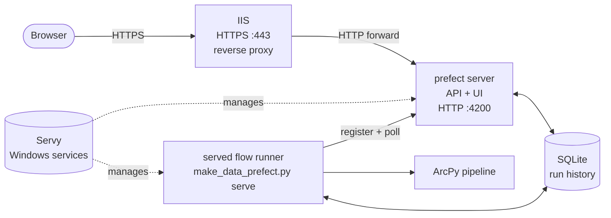

# Prefect — Production Deployment Setup

This guide walks through standing up the project's ArcPy pipeline as a
production Prefect deployment on a Windows server. The end result is a
scheduled, monitored, self-restarting orchestrator accessible to users over
HTTPS on the corporate network. The deployment stack is:

1. **IIS** as a public-facing reverse proxy that handles HTTPS termination and
    forwards requests to the local Prefect web UI.
2. **Servy** as the Windows-service wrapper that keeps both Prefect processes
    running across reboots and crashes.
3. **`prefect server`** — the Prefect API and web UI, exposed on
    `http://127.0.0.1:4200`.
4. **The served flow process** (`scripts/make_data_prefect.py serve`) — the
    long-running runner that registers the deployment, fires scheduled runs,
    enforces the concurrency guard, and executes flow runs.

!!! note "Two processes required"
    Prefect splits its concerns across two long-running processes: the API
    server backs the UI, stores run history, and accepts manual launch
    requests, while the served flow runner is responsible for evaluating its
    schedule, queuing runs, and executing them. Both must be running for
    scheduled flows to execute automatically.


```mermaid
flowchart LR
    browser([Browser])
    iis[IIS<br/>HTTPS :443<br/>reverse proxy]
    server[prefect server<br/>API + UI<br/>HTTP :4200]
    runner[served flow runner<br/>make_data_prefect.py serve]
    pipeline[ArcPy pipeline]
    storage[(SQLite<br/>run history)]
    servy[(Servy<br/>Windows services)]

    browser -->|HTTPS| iis
    iis -->|HTTP forward| server
    runner -->|register + poll| server
    runner --> pipeline
    server <--> storage
    runner <--> storage
    servy -. manages .-> server
    servy -. manages .-> runner
```

IIS is the public front door for the deployment: it terminates HTTPS at the
server's hostname and forwards traffic to the Prefect web UI running locally
on port 4200. Configuring it first means the reverse-proxy rule is in place
and ready to route requests as soon as the Prefect services come online.

## 1. Configure IIS as a Reverse Proxy

### 1.1 Enable Windows Features

Open **Control Panel → Programs → Turn Windows Features On or Off** and enable:

- **Internet Information Services**
    - **Web Management Tools** — IIS Management Console
    - **World Wide Web Services**
        - **Common HTTP Features** — Default Document, Static Content, HTTP Errors
        - **Application Development Features** — ISAPI Extensions, ISAPI Filters

### 1.2 Install the Reverse-Proxy Modules

- [URL Rewrite](https://www.iis.net/downloads/microsoft/url-rewrite) (v2+)
- [Application Request Routing](https://www.iis.net/downloads/microsoft/application-request-routing) (ARR)

After both are installed, restart IIS so it picks up the new modules. In
**IIS Manager**, select the server (machine name) at the top of the
**Connections** pane on the left, then click **Restart** under the **Manage
Server** group in the **Actions** pane on the right.

### 1.3 Enable HTTPS

!!! warning "Security Certificate"
    You will need a security certificate for your machine to successfully
    complete this step.

In IIS Manager:

1. Select the machine name → **Server Certificates → Import** → select your
    `.pfx` file.
2. **Sites → Default Web Site → Edit Bindings → Add**, choose type `https`, and
    select the certificate you just imported.

!!! note "Esri Internal Users"
    Domain certificates can be created and downloaded from the internal
    [Create SSL Server Certificates](https://certifactory.esri.com/certs/) site.

### 1.4 Configure the Reverse Proxy to Prefect

Prefect's web UI and API listen on `http://127.0.0.1:4200` by default.

1. Enable proxying at the server level: select the machine name →
    **Application Request Routing Cache → Server Proxy Settings → Enable proxy
    → Apply**.

2. At **Default Web Site → URL Rewrite → Add Rule(s) → Blank Rule**, set:

    | Field | Value |
    |---|---|
    | Name | `Prefect Reverse Proxy` |
    | Match URL → Using | `Regular Expressions` |
    | Match URL → Pattern | `(.*)` |
    | Action type | `Rewrite` |
    | Rewrite URL | `http://localhost:4200/{R:1}` |
    | Append query string | checked |

    !!! warning "`The rule reference "1" is not valid`"
        This alert means IIS doesn't see a capture group in the **Match URL**
        pattern. Make sure **Using** is set to `Regular Expressions` (not
        `Wildcards`) and that the **Pattern** is `(.*)` — the parentheses are
        the capture group that `{R:1}` refers to.

3. Apply, then browse to `https://<your-host>/` — you will get a `502` until
    the Prefect server service is running; that is expected.

!!! warning "Tell the UI where the API lives"
    The Prefect UI is a browser application that calls the Prefect API
    directly. When the UI is reached through the reverse proxy at
    `https://<your-host>/`, the browser must be told the externally visible
    API address, otherwise its API calls will target `127.0.0.1:4200` and
    fail. Set `PREFECT_UI_API_URL` to the proxied API URL
    (`https://<your-host>/api`) in the **server** service's environment
    variables (§6.1).

!!! note "Hosting Prefect under a sub-path (e.g. `https://<your-host>/prefect`)"
    If the server also hosts other applications, you may want Prefect reachable
    at a sub-path rather than the site root. This requires two coordinated
    changes — one in IIS and one in the Prefect server settings — because the
    UI builds absolute URLs for its API calls and static assets.

    **In IIS:** replace the single rewrite rule above with one scoped to the
    sub-path. The pattern strips the prefix before forwarding so the upstream
    Prefect process still sees root-relative URLs:

    | Field | Value |
    |---|---|
    | Name | `Prefect Reverse Proxy` |
    | Match URL → Pattern | `^prefect(?:/(.*))?$` |
    | Action type | `Rewrite` |
    | Rewrite URL | `http://localhost:4200/{R:1}` |
    | Append query string | checked |

    **In Prefect:** set `PREFECT_UI_API_URL` to `https://<your-host>/prefect/api`
    (see §6.1) so the UI issues its API calls under the matching sub-path.
    Without it, the UI will load but its API and asset requests will 404
    because they will be issued against the site root rather than the
    sub-path.

---

## 2. Install Prefect

Prefect must be installed alongside `arcpy`, but installing it directly into
the stock ArcGIS Pro `arcgispro-py3` environment is not supported — that
environment is managed by ArcGIS Pro and pip-installing into it can break
future Pro upgrades. Instead, **clone** `arcgispro-py3` into the project tree
and install Prefect into the clone.

!!! tip "Automated alternative"
    The script [`scripts/setup_prefect.ps1`](../../scripts/setup_prefect.ps1)
    automates the runtime bootstrap and service start-up actions described in
    this guide. The manual steps below are equivalent and are documented for
    transparency and partial reruns.

### 2.1 Clone the `arcgispro-py3` environment

ArcGIS Pro ships its own conda distribution. The simplest way to get a shell
where `conda` is on `PATH` and pointed at the Pro-bundled installation is to
open the **Python Command Prompt** that ArcGIS Pro installs:

**Start → All Programs → ArcGIS → Python Command Prompt**

In that prompt, change directory to the project root and run a single command
to clone the stock environment into an `env\` directory inside the project:

```
cd C:\projects\arcpy-orchestration
conda create --prefix ./env --clone arcgispro-py3
```

Answer `y` when conda prompts to proceed. Using the conda binary that ships
with ArcGIS Pro — rather than a separately installed Anaconda or Miniconda —
ensures the clone resolves the same channels and metadata Pro itself uses.

!!! warning "Allow time and disk space"
    A full clone of `arcgispro-py3` typically takes 5–15 minutes and consumes
    several GB of disk space. The clone is a complete copy, not a hard-linked
    overlay.

### 2.2 Install the project and Prefect into the clone

Still in the Python Command Prompt at the project root, activate the cloned
env and install this project (which brings in Prefect via its dependencies)
with an editable install:

```
conda activate ./env
pip install -e .
```

Verify the install:

```
prefect --version
python -c "import prefect, aiosqlite; print(prefect.__version__)"
```

---

## 3. Configure the Prefect Runtime

Prefect reads its runtime settings (home directory, metadata database, result
storage, and API URL) from the `orchestration.prefect` block in
[`config/config.yml`](../../config/config.yml). The project resolves these
values, validates them, and exports them as `PREFECT_*` environment variables.

### 3.1 Runtime keys in `config.yml`

The relevant block under `environments.default` looks like this:

```yaml
orchestration:
  prefect:
    home_path: "prefect_home"
    api_database_connection_url: "sqlite+aiosqlite:///prefect_home/prefect.db"
    local_storage_path: "prefect_home/storage"
    results_persist_by_default: true
    api_url: "http://127.0.0.1:4200/api"
    worker_type: "process"
    work_pool_name: "local-process-pool"
```

All project-local paths must resolve inside the project root; the resolver
rejects paths that escape it. These map onto the following `PREFECT_*`
variables:

- `PREFECT_HOME`
- `PREFECT_API_DATABASE_CONNECTION_URL`
- `PREFECT_LOCAL_STORAGE_PATH`
- `PREFECT_RESULTS_PERSIST_BY_DEFAULT`
- `PREFECT_API_URL`

!!! warning "SQLite is fine here, but mind its limits"
    This guide configures Prefect's metadata store using **SQLite**
    (`sqlite+aiosqlite`). SQLite is well-suited to a single-server deployment
    like this one, but it uses file-level locking, so it must live on local
    disk — never on a network share or cloud-mounted drive — and very large
    run histories will degrade read performance over time. For higher-volume
    or multi-server deployments, point `api_database_connection_url` at a
    PostgreSQL instance instead (see the
    [Prefect settings reference](https://docs.prefect.io/v3/develop/settings-and-profiles)).

### 3.2 Bootstrap the runtime configuration

Run bootstrap first in every new shell used for orchestration commands. It
resolves the config values, checks SQLite health, and exports the `PREFECT_*`
variables into the current shell:

```powershell
.\scripts\setup_prefect.ps1 -Action bootstrap
```

To display the effective resolved values without exporting anything else:

```powershell
.\scripts\show_prefect_runtime.ps1
```

In the production deployment, these same variables are set on each Servy
service rather than exported by hand (see §6).

---

## 4. Understand the Prefect Flow Definition

The pipeline's Prefect wiring lives in
[`scripts/make_data_prefect.py`](../../scripts/make_data_prefect.py). This
single file is the entry point referenced by the served flow process (see §6.2)
and is also importable for one-shot runs. For a typical deployment of *this*
project no edits are required — the rest of this section explains the patterns
the file uses so you can apply the same structure when adapting the project, or
porting these conventions to a pipeline of your own.

!!! note "Flows and tasks"
    This file uses Prefect's **`@flow`** and **`@task`** decorators. Each task
    is an individually tracked unit of work; the flow composes them and Prefect
    records per-task state, timing, and logs in the UI. The underlying compute
    is ordinary Python — the decorators add orchestration, not new logic.

### 4.1 What the file is responsible for

The definitions module has four jobs:

1. **Make the project package importable** when Prefect loads the file from a
    working directory of its own choosing (it does not rely on a
    `pip install -e .` having happened in some other shell).
2. **Wrap each pipeline step as a `@task`** so Prefect can track, retry, and
    visualize it.
3. **Compose the tasks into a single `@flow`** that runs them in dependency
    order.
4. **Serve the flow** with a managed concurrency guard so it can be scheduled
    and triggered from the UI.

### 4.2 Key patterns and why they matter

#### Bootstrap so `arcpy_orchestration` is importable

```python
DIR_PRJ = Path(__file__).parent.parent

if importlib.util.find_spec("arcpy_orchestration") is None:
    src_dir = DIR_PRJ / "src"
    if not src_dir.exists():
        raise EnvironmentError("Unable to import arcpy_orchestration.")
    sys.path.insert(0, str(src_dir))
```

In a properly provisioned conda env (§2.2) the editable install puts
`arcpy_orchestration` on `sys.path` and the `if` branch is a no-op. The
fallback exists so that a developer who runs the file *before*
`pip install -e .` still gets a working module rather than a confusing
`ModuleNotFoundError`.

!!! tip "Apply this pattern to your own definitions"
    Always derive `DIR_PRJ` from `Path(__file__)`, not from the current
    working directory. The served process sets its own CWD, and relative paths
    derived from `os.getcwd()` will silently break in production.

#### Resolve config values at module scope, not inside tasks

```python
WORKING_WKID: int = config.spatial.working_wkid
WALK_DISTANCE_M: float = config.park_access.walk_distance_m
PARKS_FC: str = str(DIR_PRJ / config.park_access.parks_fc)
```

Reading [`config/config.yml`](../../config/config.yml) once at import time
keeps task functions focused on orchestration. It also surfaces config errors
at load time — the served process will refuse to start with a clear traceback
rather than silently failing on the first scheduled run. Never hardcode WKIDs,
distances, or paths inside a task body.

#### One task per logical step, wired by return values

Each step of the pipeline is its own `@task`, and downstream tasks receive
upstream results as arguments so Prefect infers the dependency order:

```python
@task
def project_inputs_task() -> tuple[str, str]:
    ...
    return parks, parcels


@task
def parcels_near_parks_task(parks_projected: str, parcels_projected: str) -> str:
    ...
```

!!! note "Tasks should be thin"
    Resist the urge to put real work directly inside a `@task`. Keeping the
    business logic in `arcpy_orchestration.park_access` means it stays
    unit-testable without Prefect, and the same code can be reused from a
    notebook, a Python toolbox, or a different orchestrator.

#### Compose the flow and enable result persistence

```python
@flow(name="park-access-flow", persist_result=True, log_prints=True)
def park_access_flow() -> str:
    parks_projected, parcels_projected = project_inputs_task()
    nearby_parcels = parcels_near_parks_task(parks_projected, parcels_projected)
    parcel_summary = summarize_parcels_task(nearby_parcels)
    return export_summary_task(parcel_summary)
```

`persist_result=True` stores the flow's return value and `log_prints=True`
routes `print` output into the Prefect logs, so operator-facing milestones and
diagnostics land in the same place.

#### Serve the flow with a single-run concurrency guard

```python
FLOW_CONCURRENCY_LIMIT = 1
FLOW_COLLISION_STRATEGY = "ENQUEUE"
```

ArcPy is not safe to run concurrently against the same workspace, so the served
deployment caps the flow to one in-flight run and **enqueues** overlapping
triggers rather than running them in parallel.

### 4.3 Logging integration

Because every `arcpy_orchestration` module logger propagates to the Python root
logger, and the flow is decorated with `log_prints=True`, log records and
`print` output from the pipeline appear automatically in the Prefect UI run
logs — no custom handler is required. Use the package's module loggers for
detailed diagnostics; they flow through to the same place.

---

## 5. Install Servy

Servy wraps any executable as a native Windows service. It provides automatic
restart on failure, log rotation, and a simple UI for editing the
configuration.

1. Download the **.NET 10+ self-contained installer** from
    [servy-win.github.io](https://servy-win.github.io/).
2. Run the installer and accept the defaults.

---

## 6. Configure the Prefect Services in Servy

Prefect requires **two separate Servy services** — one for the API server and
one for the served flow process. Both share the same `PREFECT_*` environment
configuration.

!!! note "Prerequisites"
    - The cloned conda environment at `C:\projects\arcpy-orchestration\env`
        exists (see §2.1) and contains `prefect` and this project (see §2.2).
    - You know the absolute path to `prefect.exe` in the cloned env's
        `Scripts\` directory (e.g.
        `C:\projects\arcpy-orchestration\env\Scripts\prefect.exe`) and to
        `python.exe` at the env root (e.g.
        `C:\projects\arcpy-orchestration\env\python.exe`).
    - The `orchestration.prefect` block in `config/config.yml` is populated
        (see §3.1).

!!! note "Why not a separate worker service?"
    This project serves the flow with `flow.serve()`, which runs its own
    in-process runner that polls for and executes scheduled runs. That removes
    the need for a separate `prefect worker` / work-pool service. The
    `start-worker` action in `setup_prefect.ps1` exists for the alternative
    work-pool deployment model and is not required for the two-service setup
    documented here.

Launch **Servy Desktop** as Administrator, click **New** for each service, and
fill in each tab as follows.

### 6.1 Service 1 — `prefect server` (the API and UI)

#### Main

| Field | Value |
|---|---|
| Service Name | `PrefectServer` |
| Display Name | `Prefect Server` |
| Description | `Prefect API and web UI for the ArcPy orchestration project.` |
| Executable Path | full path to `prefect.exe` in the conda env `Scripts\` directory |
| Arguments | `server start --host 127.0.0.1 --port 4200` |
| Startup Directory | `C:\projects\arcpy-orchestration` |
| Startup Type | `Automatic` |
| Enable Console UI | **off** |

#### Logging

| Field | Value |
|---|---|
| Enable stdout logging | on |
| stdout log path | `C:\projects\arcpy-orchestration\reports\logs\prefect_server_stdout.log` |
| Enable stderr logging | on |
| stderr log path | `C:\projects\arcpy-orchestration\reports\logs\prefect_server_stderr.log` |
| Rotation | date-based, daily |
| Max files to retain | `14` |

#### Recovery

| Field | Value |
|---|---|
| First failure | `Restart the service` |
| Second failure | `Restart the service` |
| Subsequent failures | `Take no action` |
| Reset failure count after | `1 day` |
| Restart delay | `30 seconds` |

#### Log On

- **`LocalSystem`** for simplest setups.
- For least-privilege: create a dedicated account, grant it write access to
    `%ProgramData%\Servy`, the project root, and the conda environment.

#### Advanced — Environment Variables

Both Prefect processes read their runtime configuration from these `PREFECT_*`
variables. Set them identically on both services (values resolve from
`config/config.yml`; see §3.1):

| Name | Value | Description |
|---|---|---|
| `PREFECT_HOME` | `C:\projects\arcpy-orchestration\prefect_home` | Prefect instance home directory. Must be identical in both service configs. |
| `PREFECT_API_DATABASE_CONNECTION_URL` | `sqlite+aiosqlite:///C:/projects/arcpy-orchestration/prefect_home/prefect.db` | Project-local SQLite metadata database. Must be identical in both service configs. |
| `PREFECT_LOCAL_STORAGE_PATH` | `C:\projects\arcpy-orchestration\prefect_home\storage` | Project-local result storage directory. |
| `PREFECT_RESULTS_PERSIST_BY_DEFAULT` | `true` | Persist flow/task results by default. |
| `PREFECT_API_URL` | `http://127.0.0.1:4200/api` | API endpoint the served runner connects to. |
| `PREFECT_UI_API_URL` | `https://<your-host>/api` | Externally visible API URL the browser UI calls through the IIS reverse proxy (§1.4). **Server service only.** |
| `PROJECT_ENV` | `prod` | Activates the `environments.prod` settings block in `config/config.yml`. |

---

### 6.2 Service 2 — the served flow runner (the scheduler)

The served flow process registers the `park-access` deployment, evaluates its
schedule, enforces the concurrency guard, and executes runs. Without it,
scheduled runs will never fire.

#### Main

| Field | Value |
|---|---|
| Service Name | `PrefectServeFlow` |
| Display Name | `Prefect Serve Flow` |
| Description | `Prefect served flow runner for the ArcPy orchestration project.` |
| Executable Path | full path to `python.exe` at the conda env root |
| Arguments | `scripts\make_data_prefect.py serve` |
| Startup Directory | `C:\projects\arcpy-orchestration` |
| Startup Type | `Automatic` |
| Enable Console UI | **off** |

#### Logging

| Field | Value |
|---|---|
| Enable stdout logging | on |
| stdout log path | `C:\projects\arcpy-orchestration\reports\logs\prefect_serve_stdout.log` |
| Enable stderr logging | on |
| stderr log path | `C:\projects\arcpy-orchestration\reports\logs\prefect_serve_stderr.log` |
| Rotation | date-based, daily |
| Max files to retain | `14` |

#### Recovery

Same as the server service above.

#### Log On

Use the same account as the server service.

#### Advanced — Environment Variables

Set the same `PREFECT_*` and `PROJECT_ENV` variables as the server service
(§6.1), **except** `PREFECT_UI_API_URL`, which is only needed by the server
that hosts the browser UI.

---

### 6.3 Service Dependencies

Open the **Dependencies** tab of `PrefectServeFlow` and add `PrefectServer` as
a dependency. This ensures the API server (and its shared SQLite storage) is
fully initialized before the served flow process tries to register its
deployment.

### 6.4 Install and Start

1. In **Servy Desktop**, install each service by clicking **Install**.
2. Open **Servy Manager**, start `PrefectServer` first.
3. Watch the stdout log for a line indicating the server is serving on
    `http://127.0.0.1:4200`.
4. Start `PrefectServeFlow` and confirm in its stdout log that it resolved the
    runtime settings and began serving the `park-access` deployment.
5. Browse to `https://<your-host>/`. The Prefect UI should load and list the
    `park-access-flow/park-access` deployment under **Deployments**.

---

### 6.5 Scripted install (CLI / PowerShell alternative)

The GUI steps in §6.1–§6.4 can be reproduced headlessly with the
[Servy CLI](https://github.com/aelassas/servy/wiki/Servy-CLI) or the
[Servy PowerShell module](https://github.com/aelassas/servy/wiki/Servy-PowerShell-Module),
which is convenient for repeatable deployments. Both wrap the same service
engine as the desktop app.

!!! warning "Run elevated"
    Installing Windows services modifies the Service Control Manager, so run
    these commands from an **Administrator** PowerShell session.

!!! note "Forward slashes in environment values"
    Servy's `--envVars` / `-EnvVars` parser treats `\`, `=`, `;`, and `"` as
    special and requires escaping them (e.g. `\\` for a backslash). To keep the
    snippets readable, the `PREFECT_*` path values below use forward slashes,
    which Prefect and `pathlib` accept on Windows. Adjust
    `D:/projects/arcpy-orchestration` and `<your-host>` to match your machine.

#### Option A — `servy-cli`

```powershell
# --- Service 1: Prefect API server + UI -----------------------------------
servy-cli install `
    --name="PrefectServer" `
    --displayName="Prefect Server" `
    --description="Prefect API and web UI for the ArcPy orchestration project." `
    --path="D:\projects\arcpy-orchestration\env\Scripts\prefect.exe" `
    --params="server start --host 127.0.0.1 --port 4200" `
    --startupDir="D:\projects\arcpy-orchestration" `
    --startupType="Automatic" `
    --stdout="D:\projects\arcpy-orchestration\reports\logs\prefect_server_stdout.log" `
    --stderr="D:\projects\arcpy-orchestration\reports\logs\prefect_server_stderr.log" `
    --enableDateRotation `
    --dateRotationType="Daily" `
    --maxRotations=14 `
    --recoveryAction="RestartService" `
    --maxRestartAttempts=5 `
    --envVars="PREFECT_HOME=D:/projects/arcpy-orchestration/prefect_home; PREFECT_API_DATABASE_CONNECTION_URL=sqlite+aiosqlite:///D:/projects/arcpy-orchestration/prefect_home/prefect.db; PREFECT_LOCAL_STORAGE_PATH=D:/projects/arcpy-orchestration/prefect_home/storage; PREFECT_RESULTS_PERSIST_BY_DEFAULT=true; PREFECT_API_URL=http://127.0.0.1:4200/api; PREFECT_UI_API_URL=https://<your-host>/api; PROJECT_ENV=prod"

# --- Service 2: served flow runner (depends on the server) ----------------
servy-cli install `
    --name="PrefectServeFlow" `
    --displayName="Prefect Serve Flow" `
    --description="Prefect served flow runner for the ArcPy orchestration project." `
    --path="D:\projects\arcpy-orchestration\env\python.exe" `
    --params="scripts\make_data_prefect.py serve" `
    --startupDir="D:\projects\arcpy-orchestration" `
    --startupType="Automatic" `
    --stdout="D:\projects\arcpy-orchestration\reports\logs\prefect_serve_stdout.log" `
    --stderr="D:\projects\arcpy-orchestration\reports\logs\prefect_serve_stderr.log" `
    --enableDateRotation `
    --dateRotationType="Daily" `
    --maxRotations=14 `
    --recoveryAction="RestartService" `
    --maxRestartAttempts=5 `
    --deps="PrefectServer" `
    --envVars="PREFECT_HOME=D:/projects/arcpy-orchestration/prefect_home; PREFECT_API_DATABASE_CONNECTION_URL=sqlite+aiosqlite:///D:/projects/arcpy-orchestration/prefect_home/prefect.db; PREFECT_LOCAL_STORAGE_PATH=D:/projects/arcpy-orchestration/prefect_home/storage; PREFECT_RESULTS_PERSIST_BY_DEFAULT=true; PREFECT_API_URL=http://127.0.0.1:4200/api; PROJECT_ENV=prod"

# --- Start in dependency order --------------------------------------------
servy-cli start --name="PrefectServer"
servy-cli start --name="PrefectServeFlow"
```

!!! tip "Run under a domain service account"
    To run the services under a specific account rather than Local System, add
    `--user=".\\svc-arcpy"` (or `DOMAIN\\svc-arcpy`) to each `install` command.
    Pass the password via the `SERVY_PASSWORD` environment variable rather than
    the `--password` flag so it does not appear in process listings, and grant
    the account write access to `%ProgramData%\Servy`, the project root, and the
    conda environment.

#### Option B — Servy PowerShell module (parameter splatting)

```powershell
Import-Module "C:\Program Files\Servy\Servy.psm1" -Force

# Shared environment values (forward slashes avoid escaping; see note above).
$prefectEnv = @(
    "PREFECT_HOME=D:/projects/arcpy-orchestration/prefect_home"
    "PREFECT_API_DATABASE_CONNECTION_URL=sqlite+aiosqlite:///D:/projects/arcpy-orchestration/prefect_home/prefect.db"
    "PREFECT_LOCAL_STORAGE_PATH=D:/projects/arcpy-orchestration/prefect_home/storage"
    "PREFECT_RESULTS_PERSIST_BY_DEFAULT=true"
    "PREFECT_API_URL=http://127.0.0.1:4200/api"
    "PROJECT_ENV=prod"
) -join ";"

# Service 1: Prefect API server + UI (UI needs the externally visible API URL).
$serverParams = @{
    Name              = "PrefectServer"
    DisplayName       = "Prefect Server"
    Description       = "Prefect API and web UI for the ArcPy orchestration project."
    Path              = "D:\projects\arcpy-orchestration\env\Scripts\prefect.exe"
    Params            = "server start --host 127.0.0.1 --port 4200"
    StartupDir        = "D:\projects\arcpy-orchestration"
    StartupType       = "Automatic"
    Stdout            = "D:\projects\arcpy-orchestration\reports\logs\prefect_server_stdout.log"
    Stderr            = "D:\projects\arcpy-orchestration\reports\logs\prefect_server_stderr.log"
    RecoveryAction    = "RestartService"
    MaxRestartAttempts = 5
    EnvVars           = "$prefectEnv;PREFECT_UI_API_URL=https://<your-host>/api"
}
Install-ServyService @serverParams

# Service 2: served flow runner (depends on the server; no PREFECT_UI_API_URL).
$serveParams = @{
    Name              = "PrefectServeFlow"
    DisplayName       = "Prefect Serve Flow"
    Description       = "Prefect served flow runner for the ArcPy orchestration project."
    Path              = "D:\projects\arcpy-orchestration\env\python.exe"
    Params            = "scripts\make_data_prefect.py serve"
    StartupDir        = "D:\projects\arcpy-orchestration"
    StartupType       = "Automatic"
    Stdout            = "D:\projects\arcpy-orchestration\reports\logs\prefect_serve_stdout.log"
    Stderr            = "D:\projects\arcpy-orchestration\reports\logs\prefect_serve_stderr.log"
    RecoveryAction    = "RestartService"
    MaxRestartAttempts = 5
    Deps              = "PrefectServer"
    EnvVars           = $prefectEnv
}
Install-ServyService @serveParams

# Start in dependency order.
Start-ServyService -Name "PrefectServer"
Start-ServyService -Name "PrefectServeFlow"
```

!!! note "Switch parameters when splatting"
    With splatting, set switch flags such as date-based rotation to `$true` in
    the hashtable (e.g. `EnableDateRotation = $true`); never pass `$true` to a
    switch on an inline call. See the
    [module troubleshooting notes](https://github.com/aelassas/servy/wiki/Servy-PowerShell-Module#troubleshooting).

---

## 7. Verify Scheduling and Queue Behavior

The served deployment is capped at a single concurrent run. To confirm the
queue behaves correctly, trigger two overlapping runs:

```powershell
.\scripts\verify_prefect_queue.ps1
```

Expected behavior: the second run waits in a queued state until the first run
reaches a terminal state, rather than executing in parallel. Inspect both run
states in the Prefect UI under the deployment's **Runs** view.

To attach or adjust a schedule for the deployment, use the deployment page in
the Prefect UI (**Deployments → `park-access-flow/park-access` → Schedules**),
or configure it in the serve call. New schedules can be paused and resumed from
the same page.

---

## 8. Smoke Test the Pipeline

You can validate the pipeline two ways.

**Serverless one-shot run** — executes the flow once in-process using Prefect's
ephemeral mode, with no server required:

```powershell
.\scripts\run_prefect_smoke.ps1
```

This runs [`scripts/make_data_prefect.py`](../../scripts/make_data_prefect.py)'s
`park_access_flow` directly and prints the output path on success.

**Through the deployment** — with both services running (§6.4):

1. In the Prefect UI, open **Deployments → `park-access-flow/park-access`**.
2. Click **Run → Quick run** to trigger a manual run.
3. Open the run in the **Runs** view. The four tasks (`project_inputs_task`,
    `parcels_near_parks_task`, `summarize_parcels_task`, `export_summary_task`)
    should appear in the run graph. Click any task to view its structured log
    output — `arcpy_orchestration` log records appear here automatically via
    root-logger propagation (see §4.3).
4. Confirm the output Excel workbook is written to the path defined by
    `park_access.output_summary_path` in
    [`config/config.yml`](../../config/config.yml).

---

## 9. Recovery Procedures

### 9.1 SQLite lock/corruption recovery

If bootstrap or startup fails due to a lock or corruption in the metadata DB:

1. Stop all Prefect processes (`PrefectServer` and `PrefectServeFlow` in Servy
    Manager).
2. Identify the DB path from the runtime output
    (`PREFECT_API_DATABASE_CONNECTION_URL`).
3. Back up the DB file.
4. For **lock** errors: restart the services after confirming no process still
    holds the DB.
5. For **corruption** errors: recreate the DB (move the corrupt file aside so a
    clean file is created) and restart bootstrap.

The `assert_sqlite_health` check run during bootstrap fails fast with an
actionable message for both conditions.

---

## Troubleshooting

| Symptom | Likely cause |
|---|---|
| `PrefectServer` service starts then immediately stops | Missing or invalid `orchestration.prefect` config, a SQLite lock/corruption, or a port conflict on 4200. Check `prefect_server_stderr.log`. |
| `502 Bad Gateway` from IIS | `prefect server` is not running or is bound to a different host/port. Check Servy Manager and `prefect_server_stdout.log`. |
| UI loads but shows connection errors or no data | `PREFECT_UI_API_URL` is not set to the externally visible proxied API URL on the server service (§1.4 / §6.1). |
| Scheduled runs never fire | `PrefectServeFlow` is not running, or the deployment schedule is paused. Check the service and the deployment's Schedules page (§7). |
| Tasks execute but no `arcpy_orchestration` logs appear in the UI | Confirm the flow is decorated with `log_prints=True` and that module loggers are not setting `propagate = False`. |
| `arcpy` import error on service start | The service account cannot find the ArcGIS Pro conda environment. Verify the **Executable Path** points to `prefect.exe` / `python.exe` inside the cloned env. |
| Runs complete in the UI but the Excel output is missing | The `value_field` in `config.park_access.value_field` does not match the actual parcels schema. Inspect the feature class and update `config/config.yml`. |
| Served runner cannot reach the API after a server restart | Both services must share the same `PREFECT_API_URL` and metadata DB. Confirm the environment variables are set identically in both Servy service configs. |

Prefect is now the active orchestration platform for this project.
